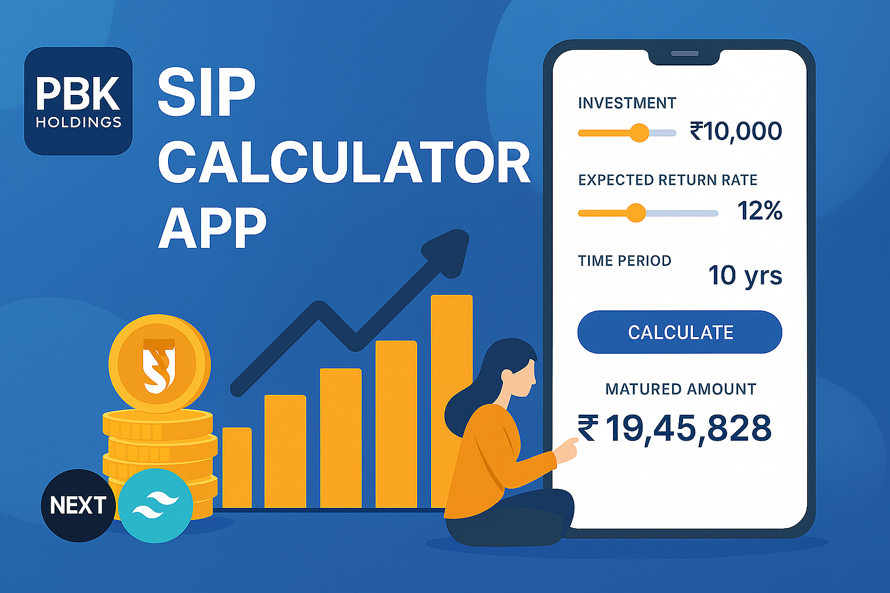
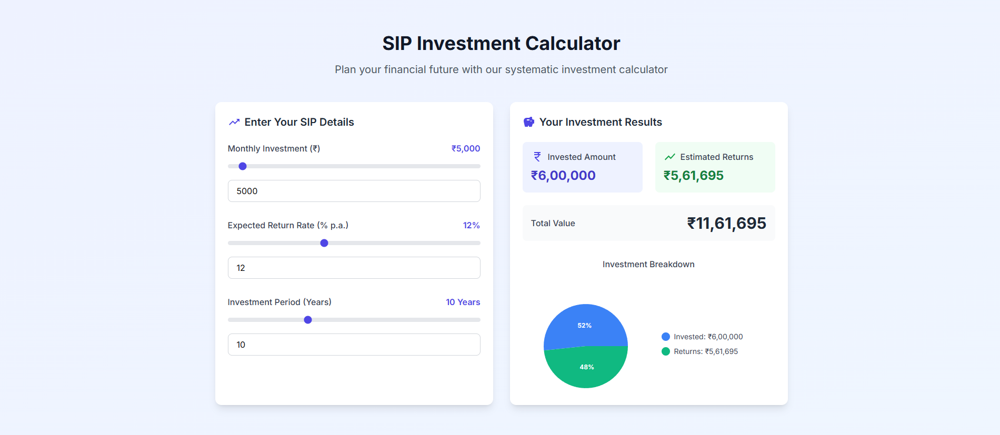

# SIP Calculator App – PBK Holdings

This is a **SIP (Systematic Investment Plan) Calculator** built using **Next.js**. The application helps users estimate returns on their SIP investments with a modern, responsive, and user-friendly UI.


---

## 🔧 Tech Stack

- **Framework**: [Next.js](https://nextjs.org/)
- **Language**: JavaScript
- **Styling**: Tailwind CSS / CSS Modules
- **Charting**: Recharts or equivalent (for pie/line graphs)
- **Dark Mode**: Enabled using Theme Context API + `localStorage`
- **Hosting**: [Vercel](https://sip-calculator-tau.vercel.app/)

**View Demo** :- https://sip-calculator-tau.vercel.app/
---

## ✨ Features

- 📱 **Responsive UI** – Works seamlessly across devices.
- 💡 **SIP Calculation Logic** – Computes total invested, estimated returns, and maturity amount.
- 🌗 **Dark Mode Support** – Auto-detects user preference with manual toggle.
- 📊 **Graphical Breakdown** – Pie chart showing invested vs returns.
- 🔧 **Custom Inputs** – Monthly Investment, Interest Rate, and Duration.
- ⚡ **Real-Time Calculation** – Instant results as values are updated.

---

## ✨ Home Page


---

## ✨ Dark mode


---

## ✨ SIP Calculator



---

## 📈 SIP Calculation Formula

The SIP calculator uses the following formula:  M = P × ((1 + i)^n – 1) / i) × (1 + i)

Where:
- `M` is the maturity amount
- `P` is the monthly investment
- `i` is the rate of return per month (annual rate / 12 / 100)
- `n` is the number of months

---

## 🚀 Getting Started

### Clone the repository

```bash
git clone https://github.com/your-username/sip-calculator.git
```bash
cd sip-calculator
```bash
npm install
```bash
npm run dev
